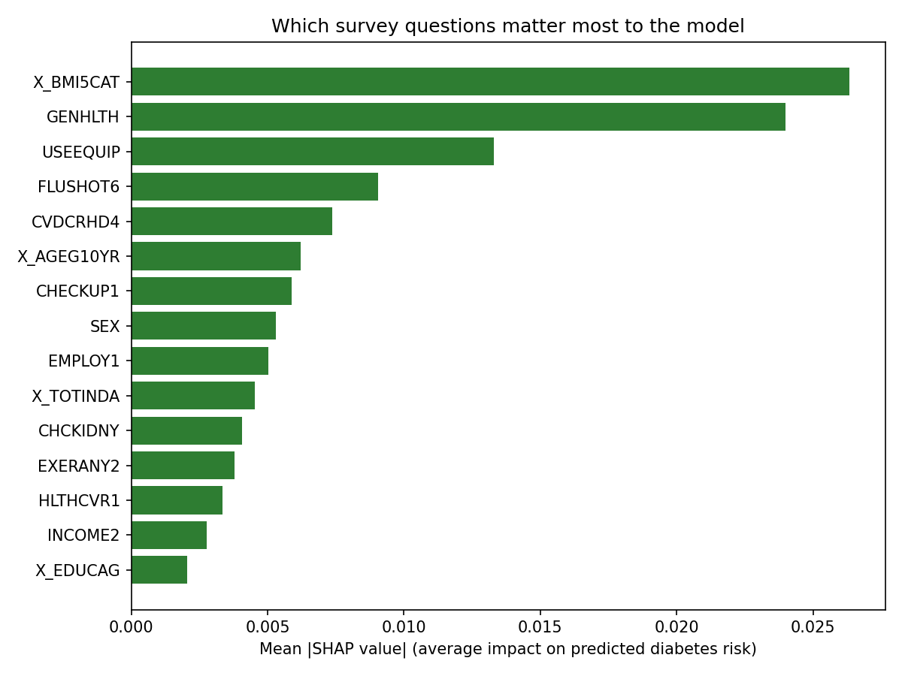

# Predicting Type 2 Diabetes from Behavioral Risk Factors

**[Live app →](#)** *(diabetes-risk-app-q4zhwrrcgvdrcwnbkfwx3sstreamlit.app)* &nbsp;|&nbsp; `app.py` &nbsp;|&nbsp; `train_model.py`

An end-to-end ML project: a Random Forest classifier trained on CDC BRFSS 2014 survey data, made explainable with SHAP, and shipped as a live interactive Streamlit app that gives users a personalized diabetes risk score.

## Problem
Which self-reported behavioral and health factors best predict a type 2 diabetes diagnosis, and can that risk be reliably quantified for an individual, not just a population?

## Approach
- **Data:** CDC 2014 BRFSS survey, cleaned and reduced to 117,141 respondents and 27 variables with established links to diabetes risk.
- **Model:** `RandomForestClassifier` in a one-hot encoded pipeline, with `class_weight="balanced"` to handle the ~18% positive class.
- **Explainability:** SHAP (`TreeExplainer`) for both global insight (what drives risk across the population) and local insight (why this person's score came out the way it did).

## Results

| Metric | Value |
|---|---|
| ROC AUC | 0.81 |
| Recall ("Yes") | 0.73 |
| Precision ("Yes") | 0.37 |

The model correctly flags 73% of actual diabetes cases, tuned deliberately toward recall since missing an at-risk person is far more costly than a false alarm in a screening context. That tradeoff comes at a cost: with precision at 0.37, roughly 2 out of 3 people flagged as high risk don't actually have diabetes, an acceptable cost for a low-stakes screening tool meant to prompt a conversation with a doctor, not a diagnosis. An ROC AUC of 0.81 shows strong separation between classes despite relying only on self-reported survey data, no lab values or clinical measurements.

**Top predictors:** BMI category, general health rating, use of mobility equipment, flu shot status, coronary heart disease history, age group.

## App
Users answer 25 survey questions and get back a predicted risk percentage plus a SHAP chart showing exactly which of their answers pushed that number up or down, turning a black-box model into something people can actually understand and act on.

## Stack
Python · pandas · scikit-learn · SHAP · Streamlit

## Files
- [`app.py`](app.py) — Streamlit app
- [`train_model.py`](train_model.py) — training + SHAP pipeline
- [`shap_importance.png`](shap_importance.png) — global feature importance
- [`BFRSS_2014_modified.csv`](BFRSS_2014_modified.csv) — dataset

---
*Source: CDC 2014 BRFSS Survey Data. Dataset reduced for demonstration; not a diagnostic tool.*